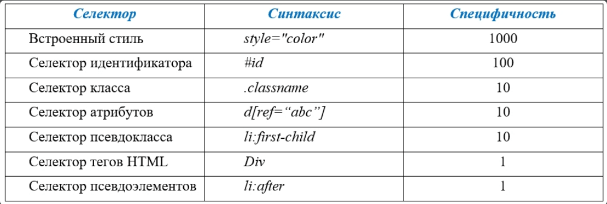

## CSS
1. Что такое CSS и откуда название
    - Порядок применения (в соотв-вии с порядком, ближе к элементу)
    - Наследование
    - Специфичность правил (вес селекторов, таблица специфичности)
    - 
    - Внешние таблицы (порядок подключения важен)
2. Способы подключения стилей
    - inline
    - ``
    - link rel (+ асинхронная загрузка)
    - js *
   
3. Видимость элементов
    - display, visibility
    - overflow
4. Размеры элементов.
    - width, height, (line-height)
    - border
    - padding
    - box-sizing (https://developer.mozilla.org/en-US/docs/Web/CSS/box-sizing)
   
5. позиционирование
   - поток документа (https://doka.guide/html/flow/)
   - position: static, relative, absolute, fixed, sticky (https://developer.mozilla.org/en-US/docs/Web/CSS/position)

6. flexbox https://flexboxfroggy.com/
7. grid https://doka.guide/css/grid-guide/

Полезные ссылки:
https://doka.guide/css/cascade/
https://doka.guide/css/specificity/

https://specificity.keegan.st/

## HOME TASK
- Исправления HOME-TASK-1
- Пройти https://flexboxfroggy.com/
